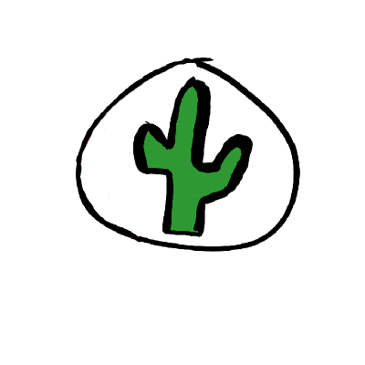

I am the main dev for SideFlipSaga and, I like coding. <em>All the code</em> in my repositories (exept forks) is my code unless I say somewhere its not.
I also maintain [leachim6/hello-world](https://github.com/leachim6/hello-world).
 

<table><tbody><tr><td>  </td></tr></tbody></table>
